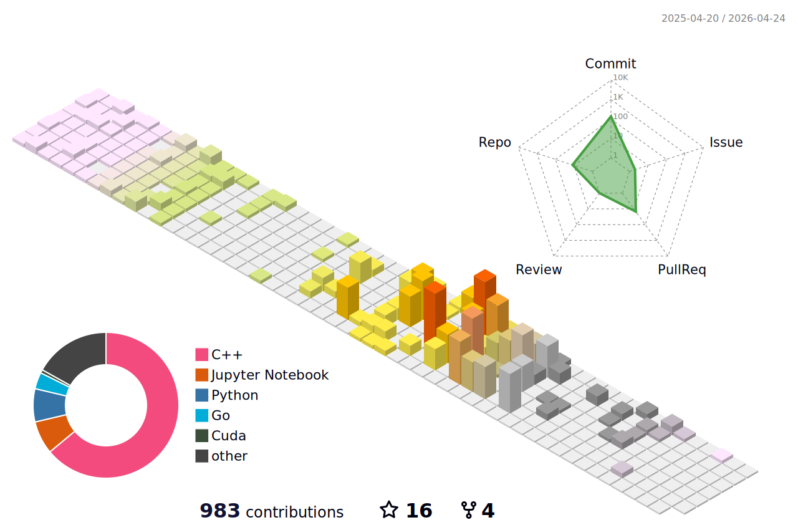

<h3 > 🤑 My Activity 🤑 </h3>

| Activity | Position | Period |
|----------|----------|----------|
| College of Software, Chung-Ang University | Student | Mar 4, 2019 ~ Feb 20, 2025 |
| Republic of Korea Army (ROKA) | Network Operation & Maintenance Specialist (175101) | Mar 8, 2021 ~ Sep 7, 2022 |
| 42Seoul 9th Cadet | Phase 1 Cadet | Mar 13, 2023 ~ Aug 26, 2024 |
| 42Seoul | Member | Aug 27, 2024 ~ Apr 27, 2025 |
| Computer Vision Machine Learning Lab | Summer PRE Program Researcher | Jun 30, 2023 ~ Aug 25, 2023 |
| OSSCA Open Source Contribution Academy | Lead Mentee (Korean Translation of PyTorch & PyTorch Lightning Docs) | Jul 8, 2023 ~ Oct 7, 2023 |
| Google for Developers Machine Learning Bootcamp 2023 | 4th Cohort | Sep 1, 2023 ~ Nov 24, 2023 |
| GDSC CAU 3rd Core Member | Flutter Team Lead | Sep 1, 2023 ~ Jun 30, 2024 |
| BOAZ 22nd Big Data Club | Analysis Division, Data Research Team | Jan 13, 2024 ~ Jan 25, 2025 |
| PyTorch Korea User Group | Member | Aug 17, 2024 ~ Present |
| Cloud Club 6th | Member | Sep 7, 2024 ~ Jan 4, 2025 |
| GDSC CAU 4th | DevRel | Sep 11, 2024 ~ Jul 26, 2025 |
| Cloud Club 7th | Operations Team | Jan 4, 2025 ~ Jul 5, 2025 |
| GenON | ML Engineer, Intern | Mar 4, 2025 ~ Jun 3, 2025 |
| CJ OliveNetworks | MLOps Engineer, Intern | Jun 12, 2025 ~ Jun 26, 2025 |
| CJ OliveNetworks | MLOps Engineer, Full-Time | Jul 14, 2025 ~ Present|

<h3 > 🎤 Speaking Engagements 🎤 </h3>

| Organization | Title | Date | Location | Link |
|--------------|-------|------|----------|------|
| AWS Students Community Day 2025 | FMOps Career Path and Required Skills for Undergraduates | May 24, 2025 | Seoul, South Korea | [View Slides](https://docs.google.com/presentation/d/1eLnobQAyZl-jh470drRFNoJK5ObpYtVaijDNBcHsXi4/edit?usp=sharing) |

<h3> 💥 My Contributions 💥</h3>

| Repository | PR Title | Description | Status | Link |
|------------|----------|-------------|--------|------|
| [`browser-use/browser-use`](https://github.com/browser-use/browser-use) | 📄 Fix incorrect documentation for `SystemPrompt` customization | Fixed misleading example in the docs for stable version | `Merged` | [#1299](https://github.com/browser-use/browser-use/pull/1299) |
| [`vllm-project/production-stack`](https://github.com/vllm-project/production-stack) | 📘 Add complete guide for vLLM Production Stack deployment on GKE with Terraform | Adds full GKE + Terraform guide for deploying vLLM with GPU support and autoscaling infra | `Merged` | [#250](https://github.com/vllm-project/production-stack/pull/250) |
| [`vllm-project/production-stack`](https://github.com/vllm-project/production-stack) | 🔧 Add complete guide for vLLM Production Stack deployment on MS Azure with Terraform | Adds comprehensive AKS deployment option with GPU support, monitoring stack, and complete documentation | `Merged` | [#552](https://github.com/vllm-project/production-stack/pull/552) |
| [`huggingface/transformers`](https://github.com/huggingface/transformers) | 🛠️ Fix warning message for PEFT models in text-generation pipeline | Properly handles PeftModel types to avoid false "not supported" warning in text-gen | `Merged` | [#36887](https://github.com/huggingface/transformers/pull/36887) |
| [`bytedance/UI-TARS-desktop`](https://github.com/bytedance/UI-TARS-desktop) | 🐞 Fix index 0 Agent handling in browser tools | Allow Agent to getting DOM element index 0 in browser-click by fixing falsy check | `Merged` | [#567](https://github.com/bytedance/UI-TARS-desktop/pull/567) |

   <h3> 🌱 I’m currently learning ... 🌱 </h3>
  <ul>
    <li>Foundation Model</li>
    <li>Pytorch & Pytorch Lighting</li>
    <li>FMOps</li>
    <li>Kubeflow</li>
    <li>Model Inference, CUDA</li>
    <li>AWS ecosystem</li>
    <li>Google cloud ecosystem</li>
    <li>Azure ecosystem</li>
    <li>Linux OS (Ubuntu, Debian, Arch, Alpine)</li>
    <li>K8s</li>
    <li>Cloud Native Arcitecture</li>
    <li>Spring boot</li>
    <li>Terraform</li>
  </ul>  

   <h3> 💪 Stack 💪 </h3> 
  <strong>Techs that i've used at least once </strong>
  <table>
      <tr>
        <td>&nbsp;</td>
        <th scope="col">Stack</th>
      </tr>
      <tr>
        <th scope="row">System</th>
        <td align="left">
          
          
        </td>
      </tr>
      <tr>
        <th scope="row">Web</th>
        <td align="left">
           
          
          
          
          
          
          
          
          
        </td>
      </tr>
      <tr>
        <th scope="row">Server</th>
        <td align="left">
          
          
          
	  
	  
          
          
          
	  
	  
	  
        </td>
      </tr>
      <tr>
        <th scope="row">DataBase</th>
        <td align="left">
          
          
		  
		  
	  	  
        </td>
      </tr>
      <tr>
        <th scope="row">Network</th>
        <td align="left">
          
          
        </td>
      </tr>
      <tr>
        <th scope="row">Mobile</th>
        <td align="left">
          
          
        </td>
      </tr>
      <tr>
        <th scope="row">Cloud Native</th>
        <td align="left">
	  
      
	  
	  
	  
	  
	  
	  
	  
	  
	  
        </td>
      </tr>
      <tr>
        <th scope="row">Machine Learning</th>
        <td align="left">
          
          
          
          
          
          
        </td>
      </tr>
      <tr>
        <th scope="row">Deep Learning</th>
        <td align="left">
          
          
	  
          
	  
	  
        </td>
      </tr>
    </table>

	

		
 💚 My Stats 💚 

		
		  
		
		
	 	
		
		
		
		
	

	

		
🌲 My github Grass 🌲

		
	

 

