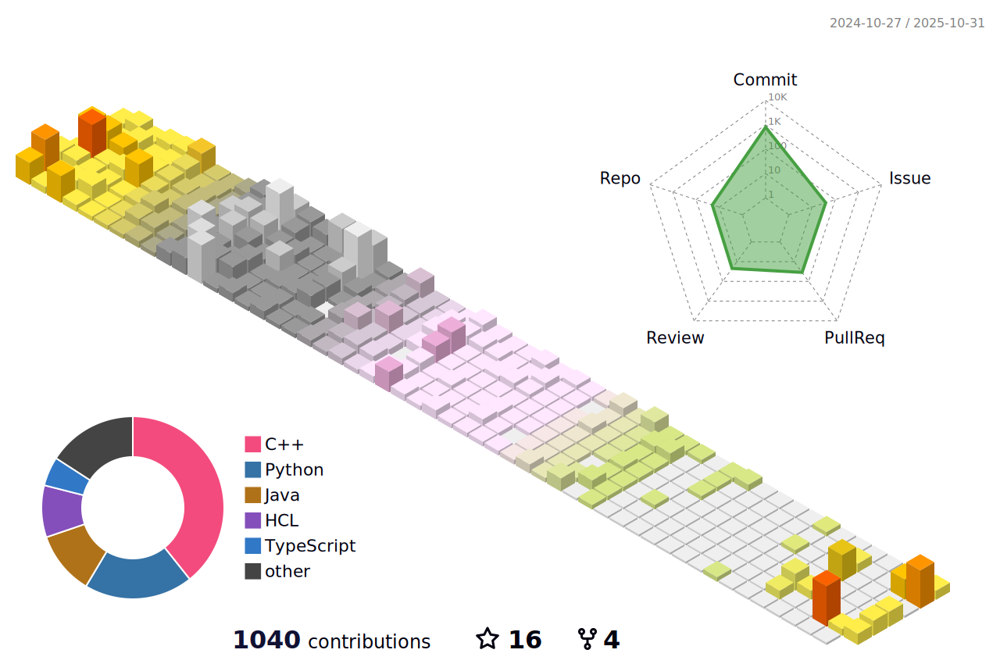

	

  

	<h3 > 🤑 My Activity 🤑 </h3>
	<ul>
		<li>School of Software, Chung-Ang University, Class of 2019 (Mar 4, 2019 ~ Feb 2025)</li>
		<li>Republic of Korea Army (ROKA), Network Operation & Maintenance Specialist (175101), Network 21-5th Class (Mar 8, 2021 ~ Sep 7, 2022)</li>
		<li>42Seoul 9th Cadet, Phase 1 (Mar 13, 2023 ~ Aug 26, 2024)</li>
		<li>42Seoul Member (Aug 27, 2024 ~ Present)</li>
		<li>2023 Summer PRE Program in Computer Vision Machine Learning Lab (Jun 30, 2023 ~ Aug 25, 2023)</li>
		<li>2023 OSSCA Open Source Contribution Academy - Lead Mentee for Korean Translation of PyTorch and PyTorch Lightning Documentation (Jul 8, 2023 ~ Oct 7, 2023)</li>
		<li>Google for Developers Machine Learning Bootcamp 2023 (4th Cohort) (Sep 1, 2023 ~ Nov 24, 2023)</li>
		<li>GDSC CAU 3rd Core Member, Flutter Team Lead (Sep 1, 2023 ~ Jun 30, 2024)</li>
		<li>BOAZ 22nd Big Data Club, Analysis Division (Jan 13, 2024 ~ Present)</li>
		<li>BOAZ 22nd Big Data Club, Analysis Division, Data Research Team (Jan 22, 2024 ~ Present)</li>
		<li>PyTorch Korea User Group Member (Aug 17, 2024 ~ Present)</li>
		<li>Cloud Club 6th (Sep 7, 2024 ~ Jan 4, 2025)</li>
		<li>GDSC CAU 4th DevRel (Sep 11, 2024 ~ Present)</li>
		<li>Cloud Club 7th Operations Team (Jan 4, 2025 ~ Present)</li>
	</ul>  

   <h3> 🌱 I’m currently learning ... 🌱 </h3>
  <ul>
    <li>Retrieval augmented generation (RAG)</li>
    <li>Large Language Model (LLM)</li>
    <li>Generative AI</li>
    <li>Pytorch & Pytorch Lighting</li>
    <li>Next.js</li>
    <li>Spring boot</li>
    <li>Terraform</li>
    <li>Kubeflow</li>
    <li>TensorRT</li>
    <li>AWS ecosystem</li>
    <li>Google cloud ecosystem</li>
    <li>Azure ecosystem</li>
    <li>Linux OS (Ubuntu, Debian, Arch, Alpine)</li>
  </ul>  

   <h3> 💪 Stack 💪 </h3> 
  <strong>Techs that i've used at least once </strong>
  <table>
      <tr>
        <td>&nbsp;</td>
        <th scope="col">Stack</th>
      </tr>
      <tr>
        <th scope="row">System</th>
        <td align="center">
          
          
        </td>
      </tr>
      <tr>
        <th scope="row">Web</th>
        <td align="center">
           
          
          
          
          
          
          
          
          
        </td>
      </tr>
      <tr>
        <th scope="row">Server</th>
        <td align="center">
          
          
          
	  
	  
          
          
          
	  
	  
	  
        </td>
      </tr>
      <tr>
        <th scope="row">DataBase</th>
        <td align="center">
          
          
        </td>
      </tr>
      <tr>
        <th scope="row">Network</th>
        <td align="center">
          
          
        </td>
      </tr>
      <tr>
        <th scope="row">Mobile</th>
        <td align="center">
          
          
        </td>
      </tr>
      <tr>
        <th scope="row">Cloud</th>
        <td align="center">
	  
          
	  
          
	  
        </td>
      </tr>
      <tr>
        <th scope="row">Machine Learning</th>
        <td align="center">
          
          
          
          
          
          
        </td>
      </tr>
      <tr>
        <th scope="row">Deep Learning</th>
        <td align="center">
          
          
	  
          
	  
        </td>
      </tr>
    </table>

	

		
 💚 My Stats 💚 

		
		  
		
		
	 	
		
		
		
		
	

	

		
🌲 My github Grass 🌲

		
	

 

